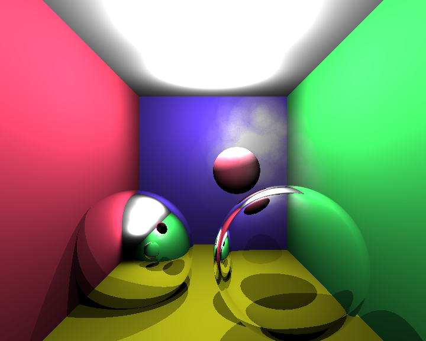
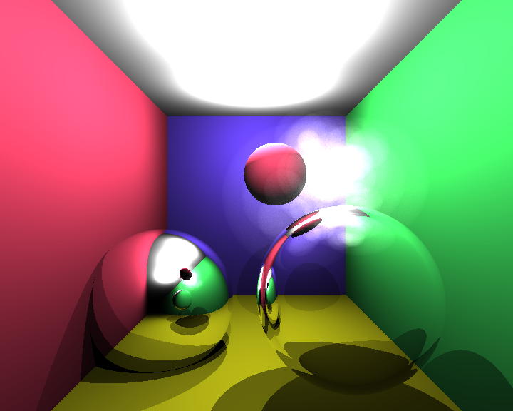
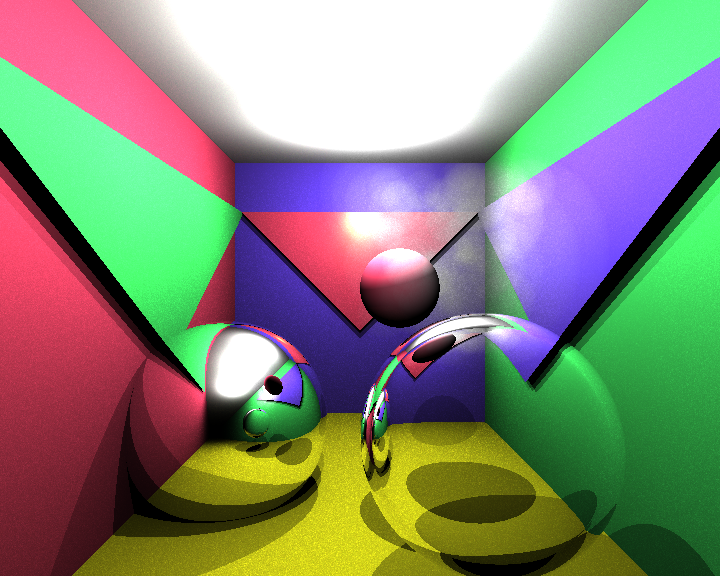
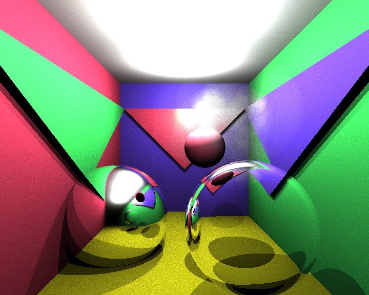

# cpu-ray-tracer

## Description
This program renders a scene using ray tracing from every pixel of the projected image to the 3D scene to compute the resulting color.  
  
Done in the context of a final project for the _UPF_ course _Synthetic Image_, held by Ricardo Marqués (UPF teacher) 

## Features
The following materials have been implemented:
- Standard
- Reflective (e.g. mirror)
- Refractive (e.g. lens)
- Smoke (simulated with many spheres generated randomly. At this point, we knew very little about volumetric rendering, so this was our approximate approach) 

Implementation of different [shaders](SourceCode/shaders), but the ones intended for final results are the [direct](SourceCode/shaders/directshader.cpp)
and [global](SourceCode/shaders/globalshader.cpp) illumination shaders.

## Results:

Both top images have been rendered using direct illumination but different color application methods for smoke. The other ones are two different generations using the same smoke algorithms with global illumination.

## Software Engine
This program has been developed using the framework (in C++) provided by Ricardo Marqués (UPF course teacher) and with his assistance.

## Contributions
**Software Developers**: Santi Paprika, Luís Oña     
**Framework developer**: Ricardo Marqués (UPF teacher)     
**Assistance**: Ricardo Marqués (UPF teacher)   
